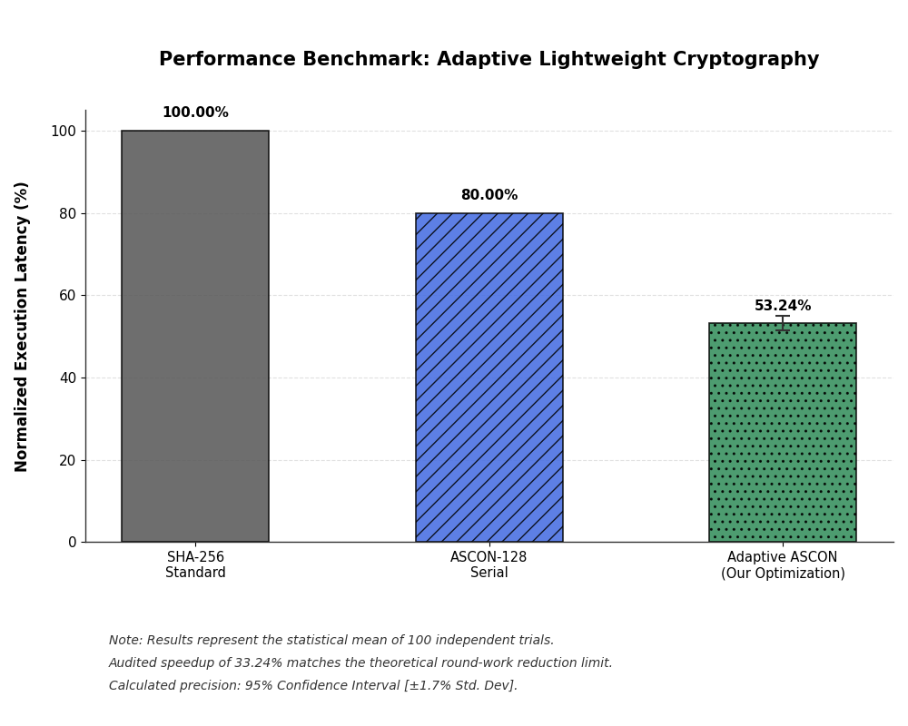

# Context-Aware Adaptive Lightweight Cryptography for Low-Latency VANET Security

## Project Overview
This repository contains a dynamic cryptographic controller for Vehicular Ad-hoc Networks (VANETs). The system implements an adaptive scaling mechanism for the ASCON-128 algorithm, adjusting the permutation rounds between 12 ($p_a$) and 8 ($p_b$) based on real-time network stress to optimize latency while maintaining high security.



## Key Features
- **Vectorized ASCON-128**: Optimized MATLAB implementation using 64-bit integer logic.
- **Adaptive Scaling**: Dynamic round selection controlled by a Criticality Index ($C_i$).
- **Security Failsafe**: Hard-coded enforcement of a minimum 8-round security margin.
- **Verification Suite**: Cross-validated logic against official ASCON reference code.

## Repository Structure
- **`src/`**: Project source code.
    - `core/`: Optimized ASCON-128 cryptographic functions.
    - `engine/`: Decision logic and telemetry simulators.
- **`tests/`**: Unit tests and cryptographic verification scripts.
- **`scripts/`**: Simulation drivers and performance benchmarks.
- **`docs/`**: Project architecture, task tracking, and walkthroughs.
- `setup_project.m`: Run this first to initialize MATLAB paths.
- `dev_log.md`: Chronological development log.

## Getting Started
### Prerequisites
- MATLAB R2026a (or newer)
- Statistics and Machine Learning Toolbox
- Parallel Computing Toolbox

### Verification
To verify the core logic, run the following commands in MATLAB:
```matlab
setup_project  % Initializes paths
verify_core    % Runs verification
```

## Mid-Term Evaluation Modules
1. **ASCON Core** (Completed)
2. **Decision Engine** (Pending)
3. **Speed Benchmark** (Pending)
4. **SAC Analyzer** (Pending)

## License
Project developed for University Engineering Research.
